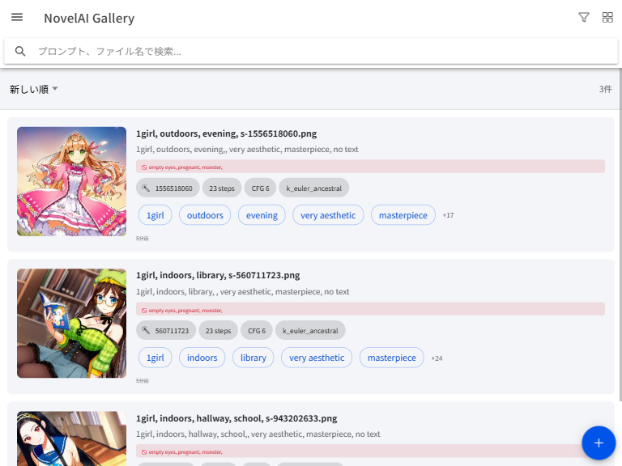
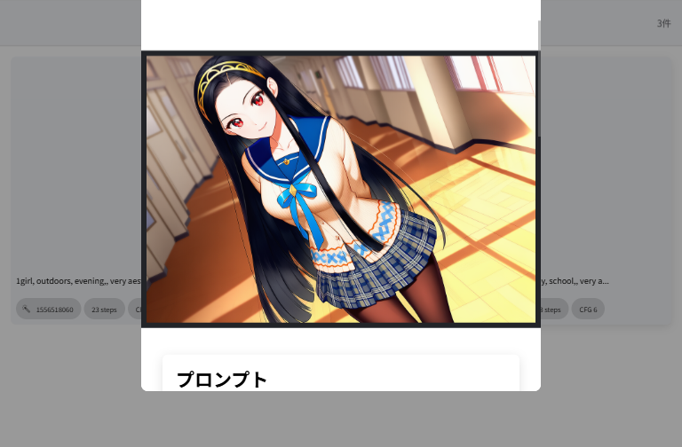

# NovelAI Gallery

An Android app for managing metadata of images generated by [NovelAI](https://novelai.net/).  
Automatically extracts prompts, generation parameters, and character information embedded in PNG/WebP files.

## Features

- **Metadata extraction** — Reads prompts, negative prompts, seed, steps, CFG scale, sampler, and character reference info directly from image files
- **Full-text search** — Fast indexed search across prompts, tags, and filenames (powered by FlexSearch)
- **Tag filtering** — Filter by tags with AND/OR toggle
- **Advanced filters** — Filter by sampler, steps range, and CFG scale range
- **Folder management** — Organize images into folders; move single or multiple images at once
- **Batch operations** — Long-press to enter multi-select mode; batch move, export, or delete
- **Favorites** — Mark frequently used images
- **Dark mode** — System / On / Off
- **Multilingual** — Japanese and English

## Screenshots

<p></p>

<p></p>

## Requirements

- Android 7.0 (API 24) or higher

## Build from Source

### Prerequisites

- Node.js 18 or higher
- npm
- Android Studio
- Java 17

### Steps

```bash
# 1. Clone the repository
git clone https://github.com/PYU224/NovelAI-Gallery.git
cd NovelAI-Gallery

# 2. Install dependencies
npm install

# 3. Build the web assets
npm run build

# 4. Add Android platform
npx cap add android

# 5. Sync to Android
npx cap sync android

# 6. Open in Android Studio and build APK
npx cap open android
```

In Android Studio: **Build → Build Bundle(s) / APK(s) → Build APK(s)**

## Tech Stack

- [Vue 3](https://vuejs.org/) + TypeScript
- [Ionic Framework](https://ionicframework.com/) v8
- [Capacitor](https://capacitorjs.com/) v8
- [FlexSearch](https://github.com/nextapps-de/flexsearch) — full-text search
- [JSZip](https://stuk.github.io/jszip/) — batch export
- IndexedDB — local image metadata storage

## Privacy

This app works entirely offline. No data is sent to any server. All image metadata is stored locally on the device using IndexedDB.

## License

MIT License — see [LICENSE](LICENSE) for details.

## Author

PYU — [GitHub](https://github.com/PYU224)

---

# NovelAI Gallery（日本語）

[NovelAI](https://novelai.net/) で生成した画像のメタデータを管理するAndroidアプリです。  
PNG/WebPファイルに埋め込まれたプロンプト・生成パラメータ・キャラクター情報を自動抽出します。

## 機能

- **メタデータ抽出** — プロンプト、ネガティブプロンプト、シード値、ステップ数、CFGスケール、サンプラー、キャラクター参照情報をファイルから直接読み取り
- **全文検索** — FlexSearch によるプロンプト・タグ・ファイル名の高速インデックス検索
- **タグフィルタ** — AND/OR 切り替え付きタグ絞り込み
- **詳細フィルタ** — サンプラー・ステップ数・CFGスケールの範囲指定
- **フォルダ管理** — フォルダの作成・名前変更・削除、画像の個別/一括移動
- **一括操作** — 長押しで複数選択モードに入り、まとめて移動・エクスポート・削除
- **お気に入り** — よく使う画像を登録
- **ダークモード** — システム / オン / オフ
- **多言語対応** — 日本語・英語

## 動作要件

- Android 7.0（API 24）以上

## ビルド手順

### 必要なもの

- Node.js 18 以上
- npm
- Android Studio
- Java 17

### 手順

```bash
# 1. リポジトリをクローン
git clone https://github.com/PYU224/NovelAI-Gallery.git
cd NovelAI-Gallery

# 2. 依存パッケージをインストール
npm install

# 3. Webアセットをビルド
npm run build

# 4. Androidプラットフォームを追加
npx cap add android

# 5. Androidに同期
npx cap sync android

# 6. Android Studioで開いてAPKをビルド
npx cap open android
```

Android Studio にて **Build → Build Bundle(s) / APK(s) → Build APK(s)** を実行してください。

## 使用技術

- [Vue 3](https://vuejs.org/) + TypeScript
- [Ionic Framework](https://ionicframework.com/) v8
- [Capacitor](https://capacitorjs.com/) v8
- [FlexSearch](https://github.com/nextapps-de/flexsearch) — 全文検索
- [JSZip](https://stuk.github.io/jszip/) — 一括エクスポート
- IndexedDB — 画像メタデータのローカル保存

## プライバシー

このアプリは完全オフラインで動作します。いかなるデータも外部サーバーに送信されません。すべての画像メタデータはデバイス上の IndexedDB にのみ保存されます。

## ライセンス

MIT License — 詳細は [LICENSE](LICENSE) をご覧ください。

## 作者

PYU — [GitHub](https://github.com/PYU224)
